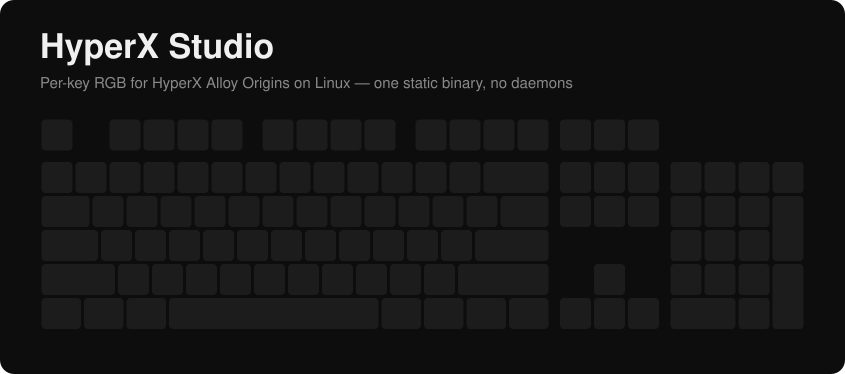
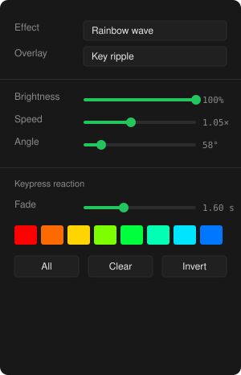

<div align="center">



[English](README.md) · **Русский**

[](https://github.com/Shehtman/hyperx-studio/actions/workflows/ci.yml)
[](LICENSE)
[](https://go.dev)
[](go.mod)
[](#сборка-из-исходников)
[](#требования)

### Подсветка HyperX Alloy Origins под Linux

Статический бинарник для подсветки и своё окно для интерфейса.
Без OpenRGB, без служб, без браузера.

</div>

> **Неофициальный проект.** Не связан с HP Inc. и HyperX. Протокол устройства
> изучен по открытой реализации в OpenRGB; код здесь написан заново.

---

## Зачем

NGENUITY существует только под Windows, а OpenRGB отдаёт эту клавиатуру с
единственным режимом — `Direct`. Аппаратных эффектов под Linux нет, поэтому
все анимации считаются программно и уходят кадр за кадром.

И это оказывается преимуществом: ограничений прошивки попросту не существует.

<table>
<tr><td width="50%" valign="top">

### Что это даёт

- **Ни одной зависимости.** Служба подсветки собрана статически — `ldd`
  отвечает *не является динамическим исполняемым файлом*. Работает на любом
  x86-64 Linux.
- **Без посредников.** Клавиатура открывается напрямую через `/dev/hidraw`;
  сервера, который можно случайно закрыть, между ними нет.
- **Своё окно** на GTK и WebKit, а не переодетый браузер. Там, где библиотек
  нет, интерфейс открывается в браузере, и больше ничего не меняется.
- **Подсветка остаётся после выхода.** Устройство держит последний кадр, пока
  есть питание.
- **16 эффектов** с живым предпросмотром того самого кадра, что уходит в порт.
- **Реакция на нажатия** через evdev, без захвата устройства.
- **Два языка** — русский и английский, переключаются на ходу.

</td><td width="50%" valign="top">



</td></tr>
</table>

---

## Требования

| | |
|---|---|
| **Система** | Debian 11+ / Ubuntu 22.04+ или любой x86-64 Linux |
| **Железо** | HyperX Alloy Origins (`03f0:0591`), полноразмерная. Без неё программа тоже запускается — окном предпросмотра; другое HID-устройство можно выбрать вручную |
| **Среда выполнения** | не нужна — бинарник статический |
| **Окно** | GTK 3 и WebKitGTK 4.1 — в GNOME уже стоят. Без них интерфейс откроется в браузере |
| **Сборка** | Go 1.21+; для окна ещё `libgtk-3-dev` и `libwebkit2gtk-4.1-dev` |

Окно интерфейса рисует отдельная программа `hyperx-studio-window`. Сама служба
подсветки от неё не зависит: без окна она работает как прежде, а интерфейс в
этом случае показывает браузер.

## Установка

Возьмите пакет в разделе [Releases](https://github.com/Shehtman/hyperx-studio/releases) и поставьте:

```bash
sudo apt install ./hyperx-studio_1.2.3-1_amd64.deb
```

Пакет кладёт бинарник, ярлык в меню и правило udev. **После установки
переподключите клавиатуру** — правам нужно примениться заново.

### Сборка из исходников

```bash
git clone https://github.com/Shehtman/hyperx-studio.git
cd hyperx-studio
go build -o hyperx-studio ./cmd/hyperx-studio
go build -o hyperx-studio-window ./cmd/hyperx-window   # окно, необязательно
sudo ./hyperx-studio --install-udev
```

## Запуск

```bash
hyperx-studio              # открыть окно
hyperx-studio --no-window  # работать в фоне (так делает автозапуск)
hyperx-studio --quit       # остановить работающий экземпляр
hyperx-studio --apply      # применить сохранённую схему и выйти
hyperx-studio --off        # погасить подсветку и выйти
hyperx-studio --browser    # показать интерфейс в браузере, а не своим окном
```

Окно можно закрыть — подсветка продолжит работать. Повторный запуск не поднимает
второй экземпляр, а показывает окно уже работающего.

`--apply` нужен для статичных схем: цвета выставляются, процесс завершается,
подсветка остаётся. Анимациям программа нужна запущенной.

## Эффекты

| | | |
|---|---|---|
| **Статика** | **Дыхание** | **Перелив спектра** |
| **Радужная волна** | **Волна двух цветов** | **Градиент** |
| **Звёзды** | **Дождь** | **Огонь** |
| **Змейка** | **Эквалайзер** | **Спектр звука** |
| **Пульс звука** | **Волна под музыку** | |
| **Волны от нажатий** | **Вспышка по нажатию** | |

Последние два реагируют на нажатия и накладываются поверх любого другого
эффекта, со своей скоростью, затуханием и цветом.

У каждого эффекта есть яркость, у большинства — скорость, угол, масштаб,
плотность, цвета, фон, насыщенность и направление. В нижней панели видны
только те настройки, которые эффект действительно использует.

### Схемы

Пятнадцать готовых схем уже внутри: «Северное сияние», «Матрица», «Звёздное
небо», «Лава», «Киберпанк», «Печатная машинка», «Удар баса» и другие. Одно
нажатие выставляет эффект, слой поверх него и все параметры сразу. Своё
сочетание можно сохранить под любым именем — оно появится в том же списке.

### Звук

Четыре эффекта следуют за тем, что играет. Звук берётся с системного вывода,
поэтому подсветка отзывается на что угодно — плеер, вкладку браузера, игру.

Это единственное место, где нужна посторонняя программа: поток даёт `parec`
(`pulseaudio-utils`) или `pw-record` (`pipewire`), и что-то из этого на обычной
Ubuntu уже стоит. Без них всё остальное работает как прежде, а звуковые
эффекты честно об этом сообщают.

Захват включается, когда выбран звуковой эффект, и глушится, когда он больше
не нужен: ни микрофон, ни вывод фоном не удерживаются. По умолчанию слушается
монитор текущего устройства вывода, но источник можно выбрать в панели.

## Что сохраняется

Три случая ведут себя по-разному, и различие важно:

| Ситуация | Что происходит |
|---|---|
| Программа закрыта, в том числе через `kill -9` | Клавиатура горит последним кадром |
| Перезагрузка компьютера | Подсветка возвращается к заводской |
| Уход в спящий режим | На время сна клавиатура отпускается, после пробуждения схема возвращается |
| Следующий запуск | Эффект, параметры, ручные цвета и выделение восстановятся |

Записать схему в память клавиатуры нельзя: устройство принимает только прямые
кадры. Поэтому вернуть свою подсветку после перезагрузки можно лишь
**автозапуском**.

Настройки пишутся в `~/.config/hyperx-studio/config.json` через полторы секунды
после изменения, атомарно, через временный файл.

### Спящий режим

Пока программа работает, клавиатура удерживается в прямом режиме подсветки.
Оставленная в нём без потока кадров, она перестаёт сигналить remote wakeup — а
поскольку с мышью она обычно сидит на одном контроллере USB, компьютер после
этого не разбудить ни тем, ни другим.

Поэтому перед сном клавиатура возвращается сама себе. Пакет ставит хук в
`/usr/lib/systemd/system-sleep/`; systemd дожидается его выполнения, так что
это происходит гарантированно до заморозки процессов:

```bash
hyperx-studio --sleep   # отпустить клавиатуру, вернуть ей собственный режим
hyperx-studio --wake    # забрать обратно и восстановить сохранённую схему
```

Команды «выйти из прямого режима» в протоколе нет — её не знают ни OpenRGB, ни
NGENUITY. Режим снимается переинициализацией устройства через `USBDEVFS_RESET`.

## Как устроено

```
┌────────────┐   HID feature reports   ┌──────────────────┐
│  движок    │ ──────────────────────▶ │ Alloy Origins    │
│  эффектов  │      /dev/hidraw        │ 107 светодиодов  │
└────────────┘                         └──────────────────┘
      ▲                                          │
      │ нажатия                                  │ USB
      │ /dev/input/event*                        ▼
┌────────────┐                          ┌──────────────────┐
│  слой      │                          │   ваши пальцы    │
│  реакции   │ ◀────────────────────────│                  │
└────────────┘                          └──────────────────┘
```

Кадр — девять feature-репортов по 65 байт: один переключает клавиатуру в режим
прямого управления, восемь несут цвета, по 16 в пакете, на цвет 4 байта —
маркер `0x81` и три составляющих.

Позиций в кадре 126, а светодиодов только 107: девятнадцать позиций физически
отсутствуют, и в них всё равно нужно слать нули — иначе раскладка сдвигается и
цвета уезжают на соседние клавиши.

<details>
<summary><b>Подробности, которые стоит знать</b></summary>

**Переключение режима идёт в каждом кадре,** а не однократно при открытии. Если
слать его только раз, клавиатура спустя время возвращается к схеме из
собственной памяти и перебивает то, что рисует программа.

**Устройство ищется по идентификаторам, а не по пути.** Номер `/dev/hidrawN`
меняется при передёргивании кабеля, поэтому программа находит клавиатуру заново
и всегда берёт USB-интерфейс `00` — именно он заведует подсветкой. Если кадр не
удалось отправить, устройство переоткрывается само.

**Нажатия помечаются той же шкалой времени, что и кадры.** Смешать абсолютные
часы со временем от старта — значит увести возраст нажатия в минус: волна
получит отрицательный радиус и не нарисуется, а вспышка залипнет на полной
яркости. На это есть отдельный тест.

**Устройства ввода не захватываются**, поэтому обычный ввод не затрагивается.

</details>

## ANSI или ISO

Раскладку нужно выбрать под свою клавиатуру, автоматически это не определяется.
Отличить просто по клавише Enter:

- **ANSI** — Enter вытянут в одну строку, а над ним отдельная клавиша `\ |`.
- **ISO** — Enter Г-образный на две строки, слева от его нижней части клавиша
  `#`, и есть лишняя клавиша рядом с `Z`.

## Если что-то не работает

<details>
<summary><b>«Клавиатура не найдена»</b></summary>

Не установлено правило udev, устройство видно только root:

```bash
sudo hyperx-studio --install-udev
```

Затем переподключите клавиатуру физически — `udevadm trigger` не всегда
пересоздаёт права на уже подключённом устройстве. Посмотреть само правило:
`hyperx-studio --print-udev`.

</details>

<details>
<summary><b>Реакция на нажатия не работает</b></summary>

Нет доступа к `/dev/input/event*`. Правило udev выдаёт его меткой `uaccess`;
запасной вариант — добавить себя в группу `input` и перелогиниться.

</details>

<details>
<summary><b>Компьютер не выходит из спящего режима</b></summary>

Исправлено в 1.0.1. Если обновляетесь с 1.0.0, проверьте, что хук на месте:

```bash
ls -l /usr/lib/systemd/system-sleep/hyperx-studio
```

Если файла нет — переустановите пакет. Перезагрузка не нужна: systemd подхватит
хук при следующем засыпании.
</details>

<details>
<summary><b>Горит только одна клавиша</b></summary>

Включён переключатель **«Только выбранные»**. Он намеренно гасит всё, кроме
выделенного; пока он включён, в панели висит пояснение с числом горящих клавиш.

</details>

## Разработка

```bash
go test ./...           # все тесты, железо не нужно
go run ./cmd/gen-assets # перерисовать картинки README из настоящей раскладки
./build-deb.sh          # собрать .deb
```

| Пакет | За что отвечает |
|---|---|
| `internal/keyboard` | протокол hidraw, раскладка кадра по слотам |
| `internal/layout` | геометрия клавиш, привязка к светодиодам и evdev |
| `internal/effects` | движок анимаций |
| `internal/input` | чтение нажатий |
| `internal/engine` | состояние, цикл рендера, сохранение |
| `internal/webui` | интерфейс, вшитый в бинарник |
| `internal/i18n` | сообщения командной строки |

Тесты проверяют раскладку кадра, привязку светодиодов, время в реактивных
эффектах, сохранение настроек и полноту переводов — и ни одному из них не нужна
клавиатура.

## Участие в разработке

Ошибки и предложения — в [Shehtman/hyperx-studio](https://github.com/Shehtman/hyperx-studio).
Перед отправкой изменений прогоняйте `go test ./...`: весь набор тестов
работает без клавиатуры.

## Лицензия

[MIT](LICENSE).

Знания о железе взяты из [OpenRGB](https://openrgb.org) (GPLv2); это независимая
реализация, его исходников она не содержит.
